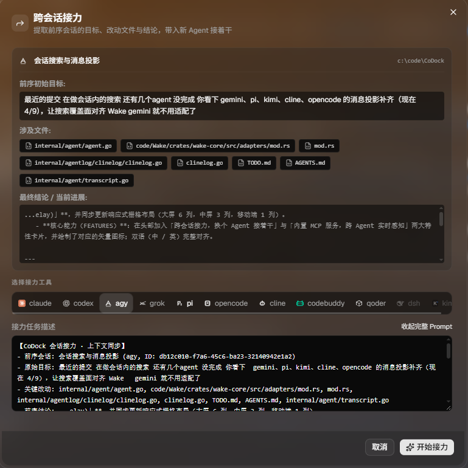

<div align="center">

# CoDock

### 本地 Coding Agent 桌面工作台与终端集成中心
### Local Coding Agent Workbench & Unified Terminal Dock

[](https://github.com/juejijianghuaa/CoDock-Release/releases)
[](https://github.com/juejijianghuaa/CoDock-Release/releases)
[](https://github.com/juejijianghuaa/CoDock-Release/blob/main/LICENSE)

<p align="center">
  <b>一个界面，聚合 12 个主流 Coding Agent</b><br/>
  Claude Code · Codex · Gemini CLI · Antigravity (agy) · Grok · Pi · Opencode · CodeBuddy · Cline · Qoder · DeepSeek Harness (dsh) · Kimi Code (kimi)
</p>

[下载最新版本 (Releases)](https://github.com/juejijianghuaa/CoDock-Release/releases/latest) • [提交 Bug / 需求反馈](https://github.com/juejijianghuaa/CoDock-Release/issues)

</div>

---

## 什么是 CoDock？ / What is CoDock?

**CoDock** 是一个面向专业开发者的本地 Coding Agent 桌面工作台与终端控制台：
- **多 Agent 并行执行**：支持在一个窗口内多 Tab 运行 Claude Code、Codex、Gemini CLI、Antigravity (agy)、Grok、Pi、Opencode、CodeBuddy、Cline、Qoder、Dsh、Kimi Code 等 12 家主流 Agent，告别杂乱的独立黑窗口。
- **跨会话接力（Session Continuity Relay）**：历史会话一键提取前序任务目标、改动文件和最终结论，生成结构化 Prompt，自由换用新 Agent 无缝接力推进（彻底解决“额度用尽或换个 Agent 接着干”的断层痛点）。
- **内置 CoDock MCP 服务（跨 Agent 历史感知与同伴协同）**：单端点 Streamable HTTP (`http://localhost:9527/mcp`) 与 stdio 模式，支持外部 Agent 跨端检索 CoDock 历史、调阅完整会话记录、以及感知并读取正在运行的同伴 Tab 终端输出。
- **独立 Git Worktree 任务并行**：在仓库旁一键开辟独立 worktree 与分支跑任务，多个会话互不踩未提交改动与 build 产物。
- **会话正文全文搜索与记录浏览**：内置 SQLite FTS5 全文索引，直接索引所有历史对话正文与代码片段，毫秒级检索定位消息锚点；会话记录支持整篇翻阅，工具调用与返回结果可单独折叠展开，支持会话内二次搜索。
- **全历史与用量看板**：本地直接解析各 Agent 的原生日志与 SQLite/JSONL 数据，聚合按项目、模型、日期的 Token 用量与成本统计。
- **专为 Coding 打造的终端增强**：基于 xterm.js 与原生 ConPTY 封装，支持滚轮穿透、图片快速粘贴、拖拽文件注入绝对路径、全局快捷键呼出。
- **Markdown Composer 独立浮窗**：专为长提示词编写设计的全功能 Markdown 输入层，支持模板复用、提示词优化与一键投递。
- **手机/平板与局域网双模协同**：支持在**原生对话流（Chat View）**与**字符终端**之间无缝一键切换。Agent 发起的单选/多选/自定义输入交互式问答自动转为原生卡片、轻触勾选提交；支持手机相册图片与本地文件直传，实时展示会话 Token 消耗与成本。

---





## 快速下载 / Downloads

请前往 [**Latest Release**](https://github.com/juejijianghuaa/CoDock-Release/releases/latest) 下载适用于您操作系统的版本：

| 操作系统 | 推荐安装包 | 备用便携版 / 适用架构 |
| :--- | :--- | :--- |
| **Windows** (Win 10 1809+) | [**CoDock-Setup-x64.exe**](https://github.com/juejijianghuaa/CoDock-Release/releases/latest) *(安装程序，含开始菜单/快捷方式)* | [**codock-windows-amd64.exe**](https://github.com/juejijianghuaa/CoDock-Release/releases/latest) *(单文件绿色版)* |
| **macOS (Apple Silicon)** | [**codock-mac-arm64.dmg**](https://github.com/juejijianghuaa/CoDock-Release/releases/latest) *(适用于 M1/M2/M3/M4 系列)* | 打开 dmg 拖入 Applications |
| **macOS (Intel)** | [**codock-mac-amd64.dmg**](https://github.com/juejijianghuaa/CoDock-Release/releases/latest) *(适用于 Intel 处理器 Mac)* | 打开 dmg 拖入 Applications |
| **Linux (x64)** | [**codock-linux-amd64**](https://github.com/juejijianghuaa/CoDock-Release/releases/latest) *(独立二进制)* | `chmod +x codock-linux-amd64` |

---

## 安装与运行指引 / Installation & Tips

### Windows
1. 下载 `CoDock-Setup-<version>-x64.exe` 并运行安装。
2. Windows 桌面版内置了针对 Windows 10/11 优化的 ConPTY 驱动与无边框自绘标题栏，默认支持最小化到系统托盘运行。
3. 也可以在设置中启用 Windows 资源管理器右键菜单集成（在任意文件夹右键直接启动 CoDock 任务）。

### macOS
1. 下载对应芯片架构的 `.dmg` 文件，双击打开并将 `CoDock.app` 拖入 `Applications`（应用程序）目录。
2. 如遇 macOS 安全机制拦截提示“未验证的开发者”：
   - 可以在“系统设置” -> “隐私与安全性”中点击“仍要打开”；
   - 或在终端中执行解隔离命令：
     ```bash
     xattr -cr /Applications/CoDock.app
     ```

### Linux
1. GUI 桌面版运行需要系统具备 `libwebkit2gtk-4.0` 运行环境（Ubuntu/Debian 执行 `sudo apt install libwebkit2gtk-4.0-37`）。
2. 如需在无 GUI 的远程服务器运行，可使用 `--tags nogui` 构建的 Server 模式：
   ```bash
   ./codock-server -addr :9527
   ```

---

## 安全与网络边界 / Security Notice

1. **本地运行优先**：CoDock 在您本机启动 PTY 会话，所有数据仅落盘在您本地目录（如 `~/.codock/`），不设远程数据中转。
2. **局域网配对门禁**：CoDock 默认开启局域网保护门禁。非本机回环（Loopback）访问时，必须携带配对令牌（可在应用内设置生成），防止局域网不可信设备直接访问控制台。
3. **Agent 自动确认机制**：CoDock 启动各 Agent CLI 时会遵循安全配置（例如跳过重复的权限弹窗）。请在受信任的开发环境中使用，切勿将端口未经认证映射到公开互联网。

---

## 问题反馈与交流 / Feedback & Community

本仓库为 **CoDock 官方发布与用户反馈仓库**。
- 如果您在日常使用中遇到 Bug、界面异常或终端交互问题，请前往 [**Issues -> New Issue**](https://github.com/juejijianghuaa/CoDock-Release/issues) 提交反馈。
- 提交 Issue 时请提供您的操作系统版本、使用的 Agent 种类以及复现步骤。
- 如果 CoDock 对您的日常 Coding 有帮助，欢迎给本仓库点一个 **Star ⭐️** 支持作者持续更新！

---

## 致谢与参考 / Acknowledgements

- 会话正文全文搜索、各 Coding Agent 消息投影（Transcript）与跨会话接力（Session Continuity）的设计与部分灵感参考了开源项目 [Wake](https://github.com/juejijianghuaa/Wake)。特此致谢！

